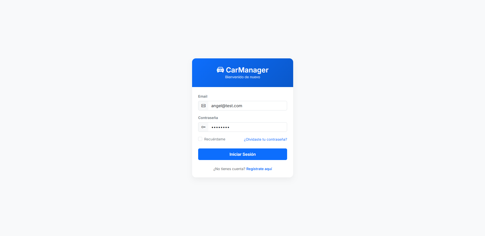
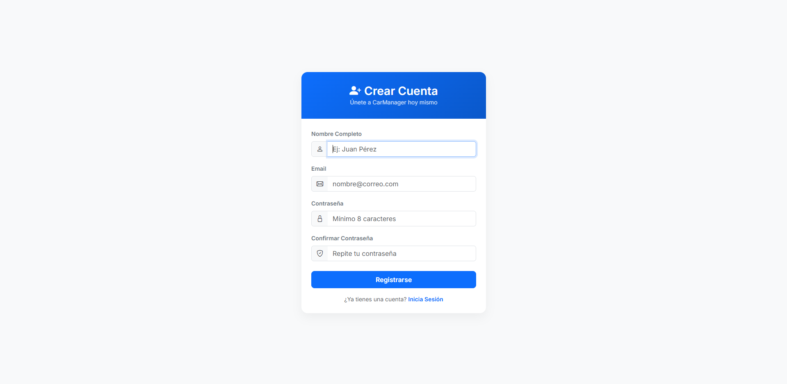
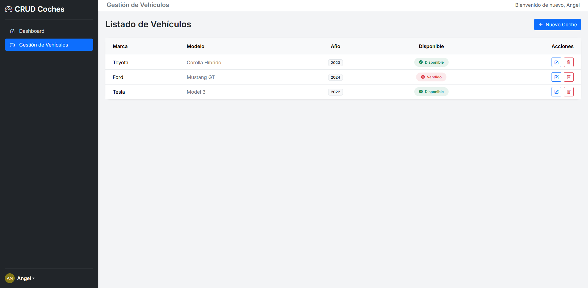
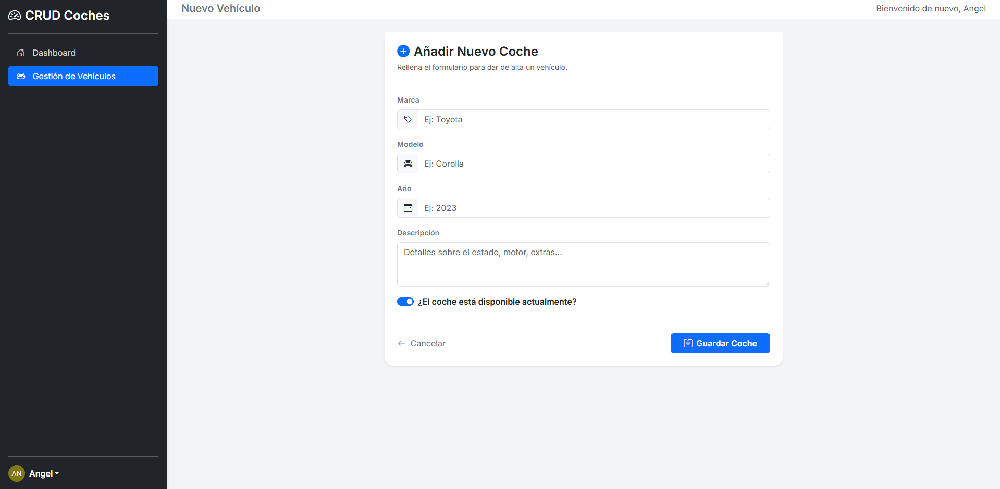
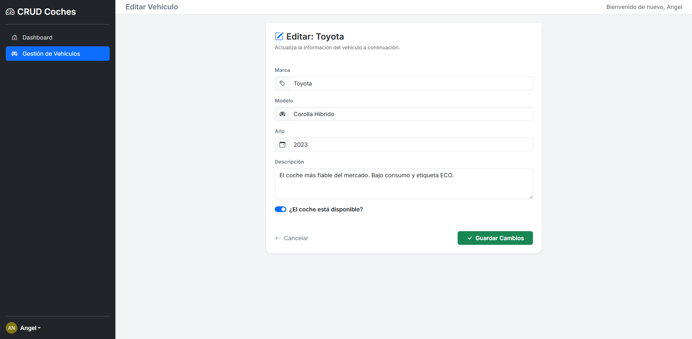

# 🚗 Gestión de Coches - Proyecto Laravel 12

Este es un sistema CRUD completo desarrollado con **Laravel 12**. El
proyecto destaca por haber sido generado rápidamente utilizando
**Laravel Blueprint** para la estructura y **Laravel Breeze** para la
seguridad.

------------------------------------------------------------------------

## 📋 Características

-   **CRUD Completo:** Gestión de coches (Crear, Leer, Actualizar,
    Borrar).
-   **Autenticación:** Login, Registro y Recuperación de contraseña.
-   **Seguridad:** Rutas protegidas (Middleware) y validación de datos.
-   **Diseño:** TailwindCSS con integración de Alpine.js para
    interactividad.

------------------------------------------------------------------------

## 🛠️ Flujo de Creación (Blueprint & Breeze)

Este proyecto se construyó siguiendo estos dos procesos clave:

### 1. Estructura con Laravel Blueprint

Se utilizó Blueprint para generar automáticamente los **Modelos,
Migraciones, Controladores y Vistas base**.

**Archivo de definición (`draft.yaml`):**

``` yaml
models:
  Car:
    brand: string
    model: string
    year: integer
    description: text
    is_available: boolean

controllers:
  Car:
    resource: index, create, store, edit, update, destroy
```

**Comandos ejecutados:**

``` bash
composer require -W --dev laravel-shift/blueprint
php artisan blueprint:build
```

> **Nota:** Tras la generación, se ajustaron manualmente las rutas y
> vistas para corregir la convención de plurales/singulares.

------------------------------------------------------------------------

### 2. Seguridad con Laravel Breeze

Se instaló **Laravel Breeze** para gestionar la autenticación de
usuarios de forma segura.

**Comandos ejecutados:**

``` bash
composer require laravel/breeze --dev
php artisan breeze:install
```

**Stack seleccionado:** Blade (HTML estándar con Tailwind).\
**Modo oscuro:** No.

Tras la instalación, se protegieron las rutas de los coches en
`routes/web.php` utilizando el middleware `auth`.

------------------------------------------------------------------------

## 🚀 Instalación para Desarrolladores

### 1. Instalar Dependencias

``` bash
composer install
npm install
```

### 2. Configurar Entorno

``` bash
cp .env.example .env
php artisan key:generate
```

Configura tu base de datos en el archivo `.env`:

``` ini
DB_CONNECTION=mysql
DB_DATABASE=concesionario_db
```

### 3. Base de Datos

``` bash
php artisan migrate
```

------------------------------------------------------------------------

## 🏁 Ejecución del Proyecto

``` bash
php artisan serve
npm run dev
```

Accede a:

http://127.0.0.1:8000/cars

------------------------------------------------------------------------

## 👤 Usuario de Prueba

``` bash
php artisan tinker
```

``` php
\App\Models\User::create([
    'name' => 'Admin',
    'email' => 'angel@test.com',
    'password' => bcrypt('12345678'),
    'email_verified_at' => now()
]);
exit;
```

Usuario: angel@test.com\
Contraseña: 12345678

------------------------------------------------------------------------

## 📂 Notas Técnicas sobre Rutas

-   Rutas (URL): PLURAL → `route('cars.index')`
-   Vistas (Carpetas): SINGULAR → `view('car.index')`

## 📸 Galería del Proyecto

### 🌐 Parte Pública
Vista de la página principal y el sistema de autenticación.

| Landing Page | Login | Registro |
| :---: | :---: | :---: |
|  |  |  |

### 🛠 Panel de Administración (CRUD)
Gestión interna de la flota de vehículos.

**1. Listado de Vehículos**
Vista principal con tabla de datos, indicadores de estado y acciones.


**2. Añadir Nuevo Vehículo**
Formulario de alta con validación.


**3. Editar Vehículo**
Vista para la modificación de datos.
